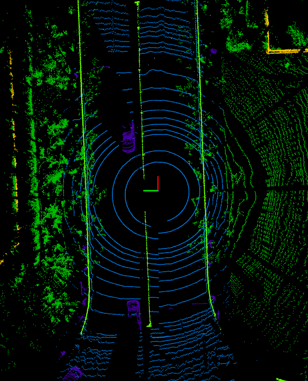

# lidar-vis
## 项目介绍

点云数据可视化工具，可实现如下功能：

- 对点云文件（pcd，bin）生成bev下的可视化图片
- 对带有3d框标注的点云数据（来源于pcd或bin）生成带bbox的bev图片
- 对带有语义分割标注的点云数据（semantic-kitti格式）生成分割标注的bev图片

## Installation

### Requirements

- yaml
- pathlib
- [pypcd-py3](https://github.com/lazy5/pypcd-py3)，经过适配python3改造的pypcd，需要从该项目库进行安装

## How to use

本项目提供了示例点云文件在examples目录下，可快速的进行可视化验证。该工具的主要代码为utils/lidar_util.py，可将该文件复制到自己的项目目录下快速实现点云数据的可视化。本项目中main函数提供了该工具的详细使用示例，可对此基于此示例代码进行使用和修改。

通过运行main函数可获得示例代码的可视化结果

```
python3 main.py
```

## 点云数据可视化结果展示

1、不依赖mayavi、open3d等可视化工具的可视化实现

| 点云可视化                 | bev+bbox               | 点云分割可视化         |
| -------------------------- | ---------------------- | ---------------------- |
| **** |  |  |

2、利用mayavi可视化工具的可视化实现

| 点云可视化                 | 点云分割可视化         | bev视角点云分割        | 跟车视角+bbox3d        |
| -------------------------- | ---------------------- | ---------------------- | ---------------------- |
| **** |  |  |  |


## Acknowlegement

Code is mainly from **[kitti_object_vis](https://github.com/kuixu/kitti_object_vis)** and **[OpenPCDet](https://github.com/open-mmlab/OpenPCDet)**

